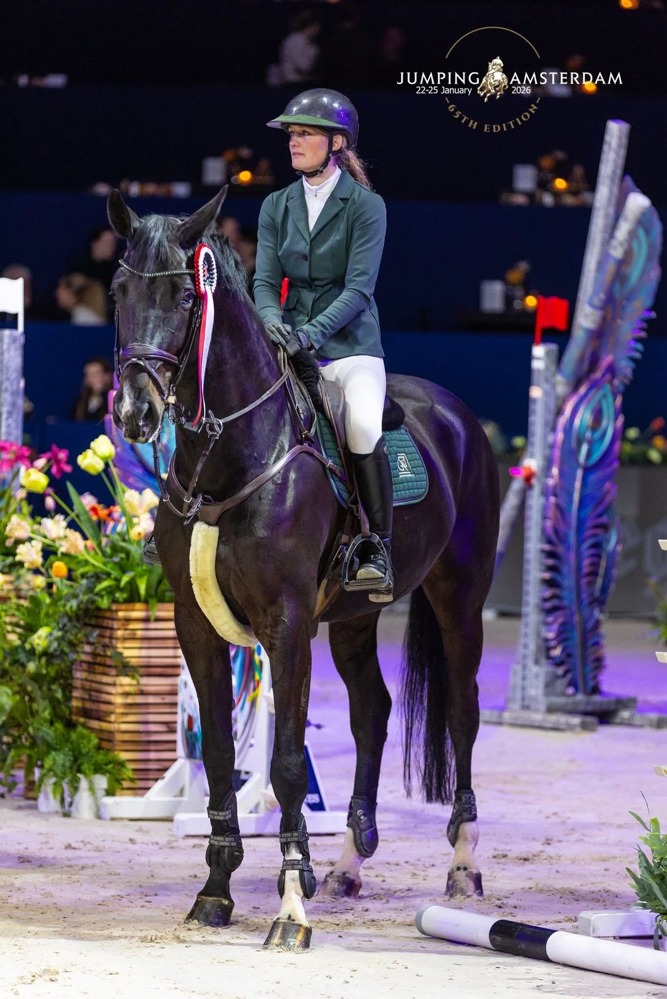

# Lucy Groenen Sporthorses

Een frisse, moderne, statische website (HTML/CSS/JS, geen framework) voor
**Lucy Groenen Sporthorses (LG Sporthorses)**. De site draait om twee dingen:
laten zien dat je bij Lucy kwaliteit **springlessen met je eigen paard** (elk
niveau) kunt volgen, en kennismaken met Lucy. Huisstijl afgeleid van het
LG Sporthorses-logo.

## Pagina's

| Bestand | Pagina |
| --- | --- |
| `index.html` | Home |
| `over-lucy.html` | Over Lucy |
| `instructie.html` | Instructie (springlessen) |
| `te-koop.html` | Te koop |
| `contact.html` | Contact (met formulier + kaart) |

## Huisstijl / kleurcodes

De kleuren zijn afgeleid uit het meegeleverde logo (`LOGO_GR.jpg` en de
EPS-bestanden). Alle kleuren staan als CSS-variabelen boven in
[`css/style.css`](css/style.css).

| Kleur | HEX | RGB | Print (referentie) |
| --- | --- | --- | --- |
| **Merkgroen** (hoofdkleur) | `#234535` | 35, 69, 53 | PANTONE 3435 C |
| **Merkgoud / zand** (accent) | `#B0A287` | 176, 162, 135 | PANTONE 2324 C — CMYK 30 / 30 / 48 / 11 |
| **Wit** | `#FFFFFF` | 255, 255, 255 | — |
| Donker goud (tekst/links) | `#6F6242` | 111, 98, 66 | leesbare variant van het merkgoud |
| Crème (achtergrond) | `#F7F3EC` | 247, 243, 236 | — |
| Donkergroen (footer) | `#172E23` | 23, 46, 35 | — |

> **Let op:** in één print-master (`...3 kleuren.eps`) staat ook **PANTONE 655 C**
> (een donkerblauw, CMYK 100 / 86 / 41 / 38 ≈ `#00165D`). Die kleur komt niet
> voor in het zichtbare logo en is niet in de webstijl gebruikt. Wil je dit als
> officiële merkkleur vastleggen, stem dat dan even af met de ontwerper.

**Typografie:** koppen in *Fraunces* (serif), bodytekst in *Inter* — beide via
Google Fonts.

## Logo & favicons

Gegenereerd uit `LOGO_GR.jpg` en opgeslagen in `images/`:

- `logo-mark.png` — het LG-monogram (gebruikt in de header/footer)
- `logo-full.png` — volledig logo incl. woordmerk
- `favicon-64.png`, `apple-touch-icon.png`, `icon-512.png` — favicons

## Eigen foto's toevoegen

De site werkt direct, maar gebruikt op een aantal plekken nette
foto-placeholders (een zachte verloop-vlak met het label *"Foto: …"*). Vervang
ze door echte foto's:

1. **Hero-achtergrond** — plaats een sfeerfoto als `images/hero.jpg`. Die
   verschijnt automatisch achter de tekst op de home- en sub-pagina's. Zonder
   foto blijft een rustige groene verloop-achtergrond zichtbaar.
2. **Sectiefoto's** — in de HTML staan blokken zoals:
   ```html
   <div class="split__media reveal">
     <!-- Vervang door eigen foto:  -->
     <div class="ph-label" aria-hidden="true"> … </div>
   </div>
   ```
   Verwijder de `ph-label`-`<div>` en zet er een `` voor in de plaats.
   Zulke fotovlakken staan o.a. op de home, Over Lucy, Instructie en Te koop.

## Contactformulier

Het formulier op `contact.html` werkt client-side: het valideert de invoer en
opent vervolgens de mailclient met een ingevuld bericht naar
`info@lgsporthorses.nl`. Wil je dat berichten automatisch binnenkomen zonder
mailclient, koppel het formulier dan aan een dienst zoals Formspree of een
eigen endpoint (pas de `id="contact-form"`-afhandeling in
[`js/main.js`](js/main.js) aan).

## Lokaal bekijken

```bash
python3 -m http.server 8000
# open http://localhost:8000
```

Of open `index.html` direct in de browser. De site heeft geen build-stap.

## Publiceren

Alle bestanden zijn statisch en kunnen op elke webhosting of statische host
(Netlify, Vercel, GitHub Pages, Cloudflare Pages, of klassieke webhosting via
FTP) geplaatst worden. Upload simpelweg de hele map.

## Contactgegevens (in de site verwerkt)

- **Telefoon / WhatsApp:** +31 6 37 40 91 72
- **E-mail:** info@lgsporthorses.nl
- **Adres:** Waalseweg 87a, Tull en 't Waal
- **Leslocatie:** Stal Schep, Tull en 't Waal
- **YouTube** en **Facebook** staan in de footer gelinkt
